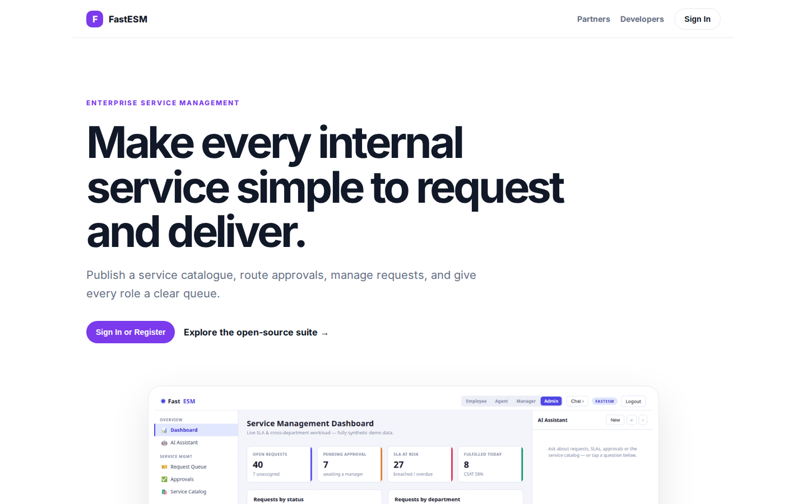
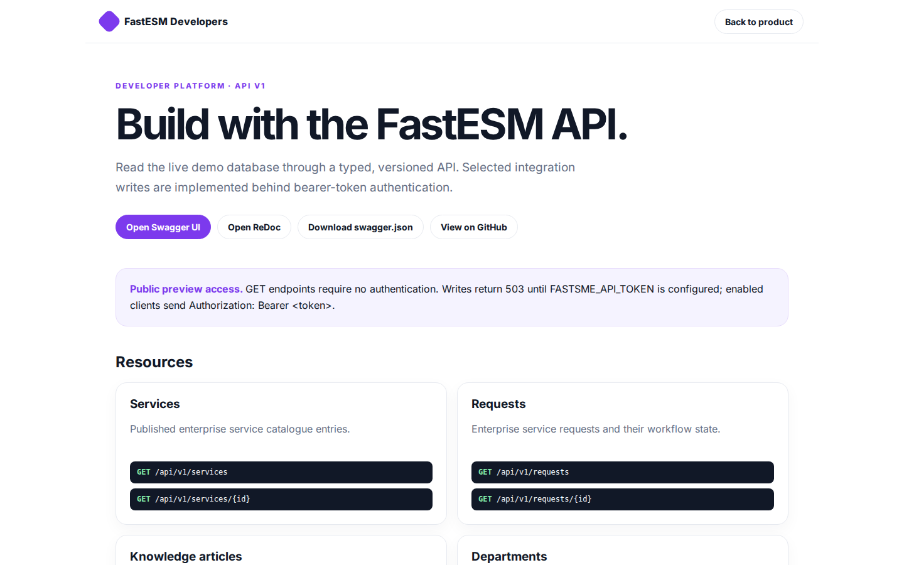

# FastESM Platform Guide

**Published:** 2026-08-19
**Platform:** [https://esm.fastsme.com](https://esm.fastsme.com)
**Source:** [github.com/predictivelabsai/FastESM](https://github.com/predictivelabsai/FastESM)

## Platform overview

**FastESM** is an open-source **Enterprise Service Management (ESM)** platform built with — Python-first, server-side, HTMX-driven, no JavaScript framework. It takes the ITSM ticket/SLA model and extends it across **every department** (IT, HR, Facilities, Finance): a **service catalog** you browse like a webshop, **req

This visual guide was reviewed against the live product using Playwright. Screens and available navigation can vary by account, role, and deployment configuration.

## 1. Make every internal service simple to request and deliver.

ENTERPRISE SERVICE MANAGEMENT Make every internal service simple to request and deliver. Publish a service catalogue, route approvals, manage requests, and give every role a clear queue. Sign In or Register Explore the open-source suite → Product tour · see th

Screen reviewed at: [https://esm.fastsme.com/](https://esm.fastsme.com/)

## 2. Build with the FastESM API.

FastESM Developers Back to product DEVELOPER PLATFORM · API V1 Build with the FastESM API. Read the live demo database through a typed, versioned API. Selected integration writes are implemented behind bearer-token authentication. Open Swagger UI Open ReDoc Do

Screen reviewed at: [https://esm.fastsme.com/developers](https://esm.fastsme.com/developers)

## 3. Sign in

Sign in with Google Sign in to continue to fastsme.com Email or phone Forgot email? Next Create account Afrikaans azərbaycan bosanski català Čeština Cymraeg Dansk Deutsch eesti English (United Kingdom) English (United States) Español (España) Español (Latinoam

Screen reviewed at: [https://accounts.google.com/v3/signin/identifier?opparams=%253F&dsh=S2098134913%3A1787122713604560&access_type=online&client_id=887059023987-2a7spj1m82eivobdbt1itb3cqca6tpt1.apps.googleusercontent.com&o2v=2&prompt=select_account&redirect_uri=https%3A%2F%2Fesm.fastsme.com%2Fauth%2Fgoogle%2Fcallback&response_type=code&scope=openid+email+profile&service=lso&state=brqJv00iPnVXkUl6LAwpJmZ4as5BoqR_CI4tsePJgKQ&flowName=GeneralOAuthLite&continue=https%3A%2F%2Faccounts.google.com%2Fsignin%2Foauth%2Flegacy%2Fconsent%3Fauthuser%3Dunknown%26part%3DAJi8hAO4L_MbbPFwldikT7P1aQ4h1PY2aCLdFgHpF6CvjLopduxNUXt1R8jDMCbgmKeY6TSbc-cIRt665-P7_1HmtGuxnkLDOpThRguKJxWSynjw4F7rolPfHFbt485eVAtBjXLkXKf-0Gw8613V5-G7CMGz6JbaWzAomIrwpt3_ReSyssD26Cw_RXX8AOC201YDgjzdJjI-2oL017uOjlJ1cN-U11fnI5y04uBOy1WQkqWG1LG1Y7fr1k7_DzdCXWekoJ2S0Hq63YlWyKc_tGndMfjqepU1VG_jfbs8r9f6S9gqfktKATnkFMW9uKI5p-ESOHnYYswzYL3edMLfEN0sKWU55LAkkCAsH54f3onquheBrHrLyPcE38RMLwxw1X8zokYFCVHaLpxw7_n1n-RbveFGj60QDflyFW0Ers1FMSgjhpJYBJlY2UEkWP377AChucHUzNsSxeu-4Po0I164Jambj0nZQA%26flowName%3DGeneralOAuthFlow%26as%3DS2098134913%253A1787122713604560%26client_id%3D887059023987-2a7spj1m82eivobdbt1itb3cqca6tpt1.apps.googleusercontent.com%23&app_domain=https%3A%2F%2Fesm.fastsme.com&rart=ANgoxcf7gR_B15nkIf95XbkVaYxuyybYBoCOtI4dLYwyTLVNcdgeZQKmcYHepBeXd5qgvvjog2oVwKzvm5iMTWZVQay2XiPWrVy7kp1RTKw481y6O1IktX4](https://accounts.google.com/v3/signin/identifier?opparams=%253F&dsh=S2098134913%3A1787122713604560&access_type=online&client_id=887059023987-2a7spj1m82eivobdbt1itb3cqca6tpt1.apps.googleusercontent.com&o2v=2&prompt=select_account&redirect_uri=https%3A%2F%2Fesm.fastsme.com%2Fauth%2Fgoogle%2Fcallback&response_type=code&scope=openid+email+profile&service=lso&state=brqJv00iPnVXkUl6LAwpJmZ4as5BoqR_CI4tsePJgKQ&flowName=GeneralOAuthLite&continue=https%3A%2F%2Faccounts.google.com%2Fsignin%2Foauth%2Flegacy%2Fconsent%3Fauthuser%3Dunknown%26part%3DAJi8hAO4L_MbbPFwldikT7P1aQ4h1PY2aCLdFgHpF6CvjLopduxNUXt1R8jDMCbgmKeY6TSbc-cIRt665-P7_1HmtGuxnkLDOpThRguKJxWSynjw4F7rolPfHFbt485eVAtBjXLkXKf-0Gw8613V5-G7CMGz6JbaWzAomIrwpt3_ReSyssD26Cw_RXX8AOC201YDgjzdJjI-2oL017uOjlJ1cN-U11fnI5y04uBOy1WQkqWG1LG1Y7fr1k7_DzdCXWekoJ2S0Hq63YlWyKc_tGndMfjqepU1VG_jfbs8r9f6S9gqfktKATnkFMW9uKI5p-ESOHnYYswzYL3edMLfEN0sKWU55LAkkCAsH54f3onquheBrHrLyPcE38RMLwxw1X8zokYFCVHaLpxw7_n1n-RbveFGj60QDflyFW0Ers1FMSgjhpJYBJlY2UEkWP377AChucHUzNsSxeu-4Po0I164Jambj0nZQA%26flowName%3DGeneralOAuthFlow%26as%3DS2098134913%253A1787122713604560%26client_id%3D887059023987-2a7spj1m82eivobdbt1itb3cqca6tpt1.apps.googleusercontent.com%23&app_domain=https%3A%2F%2Fesm.fastsme.com&rart=ANgoxcf7gR_B15nkIf95XbkVaYxuyybYBoCOtI4dLYwyTLVNcdgeZQKmcYHepBeXd5qgvvjog2oVwKzvm5iMTWZVQay2XiPWrVy7kp1RTKw481y6O1IktX4)

## Getting started

Visit [https://esm.fastsme.com](https://esm.fastsme.com) to explore FastESM. For source code and deployment details, use the GitHub link above.
